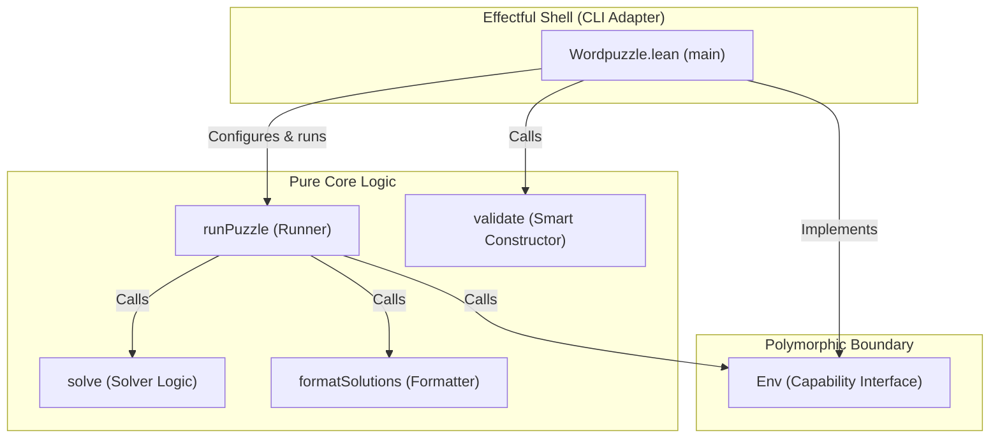

# Word Puzzle Solver

A Lean 4 implementation of a word puzzle solver.

## About

The **Word Puzzle Solver** finds words from a dictionary that can be
formed using a given set of ASCII lowercase letters (`a`–`z`).  Every
candidate word must contain a mandatory letter and be at least *n*
characters long.  Optionally, letter reuse within a single word can
be permitted.

This solves puzzles such as the
[New York Times Spelling Bee](https://www.nytimes.com/puzzles/spelling-bee).

## Architecture

The project follows the **Functional Core, Imperative Shell** pattern,
pushing all side-effects to the application boundary.



- **Pure Core** — Contains pure business rules, validation logic,
  the solver, formatting, and the control-flow runner.
- **Polymorphic Boundary** — The `Env` capability interface isolates
  console printing and file operations behind a monad parameter.
- **Effectful Shell** — The CLI adapter implements the environment
  and handles system CLI arguments.

## Installation

This project requires Lean 4.  Install it using
[Elan](https://github.com/leanprover/elan):

**Linux/macOS:**

```bash
curl -sSf https://raw.githubusercontent.com/leanprover/elan/master/elan-init.sh | sh
```

## Usage

Run the executable with a sample word puzzle via the `Makefile`:

```bash
make exe
```

Or invoke the binary directly using Lake:

```bash
lake exe wordpuzzle -s 7 -m c -l cadevrsoi
```

### Flags

| Flag                 | Description                                           |
| -------------------- | ----------------------------------------------------- |
| `-r`, `--repeats`    | Allow letters to repeat (like NYT Spelling Bee)       |
| `-s`, `--size`       | Minimum word size, 4–9 (default: `4`)                 |
| `-l`, `--letters`    | Unique ASCII lowercase letters to form words, 4–9     |
| `-m`, `--mandatory`  | ASCII lowercase letter that must appear in every word |
| `-d`, `--dictionary` | Path to the dictionary file (default: `dictionary`)   |

## Development

A `Makefile` is provided to simplify development.  Run `make help`
to list all available targets.

```bash
# Build the project
make build

# Run the unit test suite
make test

# Run the linter
make lint

# Generate documentation
make doc
```

### Documentation

To generate the project documentation locally:

```bash
make doc
```

Once generated, serve it locally to view at
[http://localhost:8000](http://localhost:8000):

```bash
python3 -m http.server \
  --directory docbuild/.lake/build/doc 8000
```

### Project Structure

```text
├── Wordpuzzle.lean         Entry point and CLI adapter
├── Wordpuzzle/
│   ├── Basic.lean          Core logic: Puzzle, validation,
│   │                       solver, Env, runner
│   └── Version.lean        Compile-time version extraction
├── Test.lean               Test harness entry point
├── Test/
│   ├── Basic.lean          Unit tests for validation,
│   |                       solver, and runner
│   └── Util.lean           Test utilities: assertions,
│                           mock environment
├── Linter.lean             Lint driver (placeholder)
├── GLOSSARY.md             Domain terminology
├── lakefile.toml           Lake build configuration
└── lean-toolchain          Lean toolchain version
```

## Licence

This project is licensed under the
[BSD 2-Clause Licence](LICENSE).
