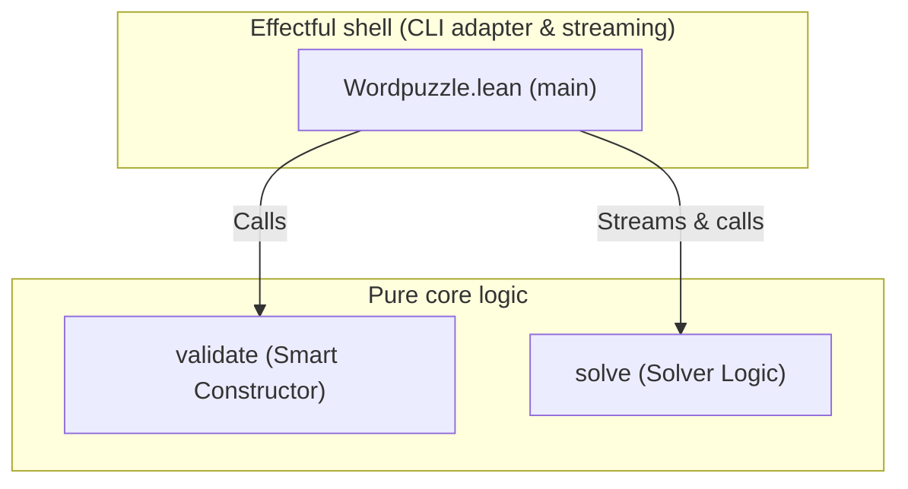

# Word puzzle solver

A Lean 4 implementation of a word puzzle solver.

## About

The **Word puzzle solver** finds words from a dictionary that can be
formed using a given set of ASCII lowercase letters (`a`–`z`).  Every
candidate word must contain a mandatory letter and be at least *n*
characters long.  Optionally, letter reuse within a single word can
be permitted.

This solves puzzles such as the
[New York Times spelling bee](https://www.nytimes.com/puzzles/spelling-bee).

## Architecture

The project follows the **functional core, imperative shell** pattern,
pushing all side-effects to the application boundary.



- **Pure core** — Contains pure business rules, validation logic,
  and the single-word solver logic.
- **Effectful shell** — The CLI adapter and runner. It parses CLI
  arguments, validates parameters, streams the dictionary file,
  and prints matching words to standard output.

### The Correctness-by-Construction Puzzle Type

In [`Wordpuzzle/Basic.lean`](
file:///home/frank/dev/lean/wordpuzzle/Wordpuzzle/Basic.lean), the `Puzzle`
type is defined as a structure bundling both the configuration data and
mathematical proofs of its invariants. This correctness-by-construction pattern
guarantees that any instanced `Puzzle` is valid:

- `repeats : Bool` — Letter reuse flag.
- `size : Nat` — Minimum word length.
- `letters : String` — Pool of unique lowercase ASCII characters.
- `mandatory : Char` — The compulsory letter.
- `h_size` — Proof that `4 ≤ size ∧ size ≤ 9`.
- `h_letters_len` — Proof that letters pool length is between 4 and 9.
- `h_letters_lower` — Proof that all pool characters are lowercase ASCII.
- `h_letters_unique` — Proof that the pool contains no duplicate characters.
- `h_mandatory_lower` — Proof that the mandatory character is lowercase ASCII.
- `h_mandatory_in` — Proof that the mandatory character is in the pool.

Because the constructor `Puzzle.mk` is private, instances can only be
created via [`validate`](
file:///home/frank/dev/lean/wordpuzzle/Wordpuzzle/Basic.lean#L117-L141). This
smart constructor runs the validators and uses Lean's decidability to produce
the required proof terms at runtime.

## Installation & Building

This project requires Lean 4. Install it using
[Elan](https://github.com/leanprover/elan):

**Linux/macOS:**

```bash
curl -sSf \
  https://raw.githubusercontent.com/leanprover/elan/master/elan-init.sh | sh
```

Once elan is installed, configure the default toolchain to stable:

```bash
elan default stable
```

### Building the Project

You can compile the project using either the `Makefile` wrapper or raw
`lake` commands.

**Using Makefile:**

```bash
# Build the default targets (library)
make build
```

**Using Lake:**

```bash
# Build the default targets (library)
lake build

# Build the wordpuzzle binary specifically
lake build wordpuzzle
```

## Usage

Run the executable with a sample word puzzle via the `Makefile`:

```bash
make exe
```

Or invoke the binary directly using Lake:

```bash
lake exe wordpuzzle -s 7 -m c -l cadevrsoi
```

### Flags

| Flag                 | Description                                           |
| -------------------- | ----------------------------------------------------- |
| `-r`, `--repeats`    | Allow letters to repeat (like NYT spelling bee)       |
| `-s`, `--size`       | Minimum word size, 4–9 (default: `4`)                 |
| `-l`, `--letters`    | [Required] Unique ASCII lowercase letters, 4–9        |
| `-m`, `--mandatory`  | [Required] Mandatory ASCII lowercase letter           |
| `-d`, `--dictionary` | Path to the dictionary file (default: `dictionary`)   |

## Development

A `Makefile` is provided to simplify development.  Run `make help`
to list all available targets.

```bash
# Build the project
make build

# Run the unit test suite
make test

# Run the linter
make lint

# Generate documentation
make doc

# View documentation locally
make viewdoc
```

### Documentation

> [!NOTE]
> Local documentation generation is rarely needed as documentation is
> automatically built and hosted on GitHub Pages via CI using the
> `leanprover-community/docgen-action`.

To generate the project documentation locally:

```bash
make doc
```

Once generated, serve it locally at
[http://localhost:8000](http://localhost:8000):

```bash
python3 -m http.server \
  --directory docbuild/.lake/build/doc 8000
```

Or view via a browser:

```bash
make viewdoc
```

### Project structure

```text
├── Wordpuzzle.lean         Entry point and CLI adapter
├── Wordpuzzle/
│   ├── Basic.lean          Core logic: Puzzle, validation, solver
│   └── Config.lean         Application configuration constants
├── Test.lean               Test harness entry point
├── Test/
│   ├── Basic.lean          Unit tests for validation and solver
│   └── Util.lean           Test utilities: assertion helpers
├── GLOSSARY.md             Domain terminology
├── lakefile.toml           Lake build configuration
└── lean-toolchain          Lean toolchain version
```

## Licence

This project is licensed under the
[BSD 2-Clause Licence](LICENSE).
