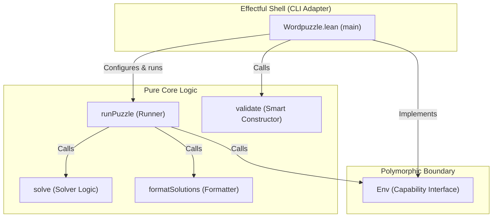

## Word Puzzle Solver

A Lean 4 implementation of a word puzzle solver.

## About

The **Word Puzzle Solver** is a simple solver for word puzzles where you
are given a set of letters and must form words that contain the mandatory
character and are at least _n_ characters long. For example, this solves
the [New York Times Spelling Bee](https://www.nytimes.com/puzzles/spelling-bee).

## Architecture

The project is structured according to the "Functional Core, Imperative
Shell" pattern, pushing all side-effects to the application boundary.



- **Pure Core**: Contains pure business rules, validation logic, solutions
  solver, formatting, and the control-flow runner.
- **Polymorphic Boundary**: The `Env` Capability Interface isolates console
  printing and file operations.
- **Effectful Shell**: The CLI adapter implements the environment and handles
  system CLI arguments.

## Installation

This project requires Lean 4. You can install it using
[Elan](https://github.com/leanprover/elan).

**Linux/macOS:**

```bash
curl https://raw.githubusercontent.com/leanprover/elan/master/toolchain.sh | sh
```

## Usage

To run the project, use the provided `Makefile` utility target:

```bash
make exe
```

This will run the executable with a sample word puzzle. Alternatively, run
the binary directly using Lake:

```bash
lake exe wordpuzzle -s 7 -m c -l cadevrsoi
```

## Development

A `Makefile` is provided to simplify development and testing targets.

```bash
# Build the project
make build

# Run the unit test suite
make test

# Run the linter
make lint

# Generate documentation
make doc
```

### Documentation

To generate the project documentation locally, run:

```bash
make doc
```

Once generated, serve the documentation locally to view it
[here](docbuild/.lake/build/doc/Wordpuzzle.html), or by invoking:

```bash
python3 -m http.server --directory docbuild/.lake/build/doc 8000
```

### Project Structure

- `Wordpuzzle.lean`: The entry point and command-line interface adapter.
- `Wordpuzzle/Basic.lean`: The core solver logic, smart constructors,
  validation rules, and capability interfaces.
- `Test/Basic.lean`: Unit tests for the validation, solver, and runner.
- `lakefile.toml`: Build configuration for Lake (Lean's package manager).

## License

This project is licensed under the [BSD 2-Clause License](LICENSE).
